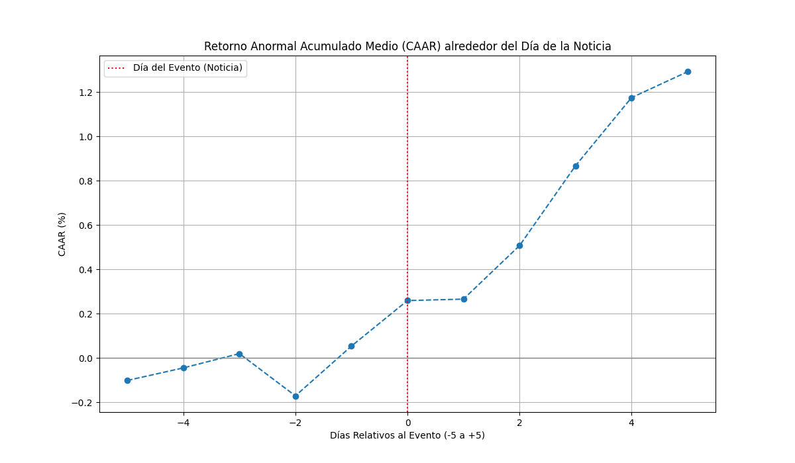

# 📈 Stock Market News Impact Analysis & Forecasting

[![Python Version][python-shield]][python-url]
[![License: MIT][license-shield]][license-url]
[![LinkedIn][linkedin-shield]][linkedin-url]


An end-to-end data science project that analyzes the financial impact of corporate news on Toyota's stock price and builds predictive models (XGBoost, LSTM, Transformer) to forecast future price movements.

<br/>
<p align="center">
  <a href="https://github.com/E-sanchez03/car-release-finance">
    
  </a>
  <p align="center">Event Study showing a ~1.25% cumulative abnormal return in the 5 days following a news event.</p>
</p>

## 📖 Table of Contents

* [🌟 About The Project](#-about-the-project)
* [🛠️ Built With](#️-built-with)
* [⚙️ Getting Started](#️-getting-started)
  * [Prerequisites](#prerequisites)
  * [Installation](#installation)
* [🚀 Usage](#-usage)
* [📊 Results](#-results)
* [🤝 Contributing](#-contributing)
* [📝 License](#-license)
* [📬 Contact](#-contact)

## 🌟 About The Project

This project investigates the classic financial question: "Do news announcements affect a company's stock price?" It provides a complete pipeline to answer this, focusing on Toyota as a case study.

**The pipeline consists of three core phases:**
1.  **Data Engineering:** A robust pipeline that collects financial data, scrapes news release dates from the web, and stores everything in a high-performance ClickHouse database via Docker.
2.  **Impact Analysis:** Using both descriptive statistics and a rigorous **Event Study** methodology, the project quantifies the abnormal returns generated around news event dates, isolating the news impact from general market trends.
3.  **Predictive Modeling:** The enriched dataset is used to train three different machine learning models (XGBoost, LSTM, and Transformer) to predict the direction of the stock price on the following day.

## 🛠️ Built With

This project utilizes a modern data science stack:

* [Python](https://www.python.org/)
* [Pandas](https://pandas.pydata.org/)
* [TensorFlow](https://www.tensorflow.org/)
* [Scikit-learn](https://scikit-learn.org/)
* [XGBoost](https://xgboost.ai/)
* [ClickHouse](https://clickhouse.com/)
* [Docker](https://www.docker.com/)
* [yfinance](https://pypi.org/project/yfinance/)
* [BeautifulSoup](https://www.crummy.com/software/BeautifulSoup/)

## ⚙️ Getting Started

Follow these steps to get a local copy up and running.

### Prerequisites

* **Python 3.9+**
* **Docker** and **Docker Compose**
* An **Alpha Vantage API Key** for financial data.

### Installation

1.  **Clone the repository:**
    ```bash
    git clone [https://github.com/E-sanchez03/car-release-finance.git](https://github.com/E-sanchez03/car-release-finance.git)
    cd car-release-finance
    ```

2.  **Create and Configure a Credentials File:**
    Create a file named `credenciales.env` in the project root.
    ```env
    # File: credenciales.env
    CH_USER=user
    CH_PASSWORD=password
    ALPHA_VANTAGE_API=YOUR_API_KEY_HERE
    ```

3.  **Launch the Database:**
    This command will start the ClickHouse database in a Docker container.
    ```bash
    docker-compose up -d
    ```

4.  **Set up a Python Virtual Environment and Install Dependencies:**
    ```bash
    # Create a virtual environment
    python -m venv venv
    
    # Activate it (Windows)
    venv\Scripts\activate
    # Or on macOS/Linux
    source venv/bin/activate
    
    # Install required packages
    pip install -r requirements.txt
    ```
    *(Note: If a `requirements.txt` file is not present, you can create one with `pip freeze > requirements.txt` after installing the packages mentioned in the Tech Stack).*

## 🚀 Usage

Execute the pipeline scripts sequentially from the project's root directory. It's highly recommended to use the `-m` flag, as it ensures Python's path resolution works correctly.

1.  **Initialize the Database:**
    ```bash
    python -m src.1_data_pipeline.initialize_database
    ```

2.  **Load Financial Data:**
    ```bash
    python -m src.1_data_pipeline.load_to_clickhouse
    ```

3.  **Enrich Data with News Events:**
    ```bash
    python -m src.1_data_pipeline.enrich_data
    ```

4.  **Perform Impact Analysis (Optional):**
    ```bash
    python -m src.2_analysis.analyze_impact_descriptive
    python -m src.2_analysis.analyze_impact_event_study
    ```

5.  **Train Machine Learning Models:**
    ```bash
    python -m src.3_modeling.train_xgboost
    python -m src.3_modeling.train_lstm
    python -m src.3_modeling.train_transformer
    ```

## 📊 Results

The analysis phase yielded several key insights:

* **Descriptive Analysis:** On average, days with news announcements show slightly higher absolute price returns and a larger trading volume compared to days without news.
* **Event Study:** The analysis reveals a statistically significant **Post-Announcement Drift**. The market reacts positively on the day of the news, but continues to incorporate the information over the next 5 trading days, resulting in a cumulative abnormal return of over **+1.25%**. This suggests a market inefficiency in processing this type of news.
* **Predictive Models:** The performance of the three models (XGBoost, LSTM, Transformer) can be compared to evaluate the trade-offs between complexity and predictive accuracy for this specific task.

## 🤝 Contributing

Contributions are what make the open-source community such an amazing place to learn, inspire, and create. Any contributions you make are **greatly appreciated**.

If you have a suggestion that would make this better, please fork the repo and create a pull request. You can also simply open an issue with the tag "enhancement".

1.  Fork the Project
2.  Create your Feature Branch (`git checkout -b feature/AmazingFeature`)
3.  Commit your Changes (`git commit -m 'Add some AmazingFeature'`)
4.  Push to the Branch (`git push origin feature/AmazingFeature`)
5.  Open a Pull Request

## 📝 License

Distributed under the MIT License. See `LICENSE` file for more information.

## 📬 Contact

Eugenio Sánchez Carreño - [https://www.linkedin.com/in/eugenio-s%C3%A1nchez-carre%C3%B1o/](https://www.linkedin.com/in/eugenio-s%C3%A1nchez-carre%C3%B1o/)

Project Link: [https://github.com/E-sanchez03/car-release-finance](https://github.com/E-sanchez03/car-release-finance)


[python-shield]: https://img.shields.io/badge/Python-3.9%2B-blue.svg
[python-url]: https://www.python.org/
[license-shield]: https://img.shields.io/github/license/othneildrew/Best-README-Template.svg?style=for-the-badge
[license-url]: https://github.com/E-sanchez03/car-release-finance/blob/master/LICENSE
[linkedin-shield]: https://img.shields.io/badge/-LinkedIn-black.svg?style=for-the-badge&logo=linkedin&colorB=555
[linkedin-url]: https://www.linkedin.com/in/eugenio-s%C3%A1nchez-carre%C3%B1o/